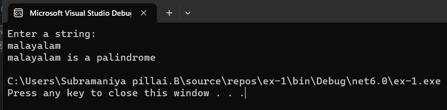

# Palindrome
## Aim:
To write a C# program to find whether the given string is a Palindrome or not.
## Algorithm:
### Step 1:
Create a new Class named palindrome.

### Step 2:
Declare two string variables called str and rev.
### Step 3:
Get the input as string from the user.
### Step 4:
Iterate the loop until the value of i is less than the lenght of string.

### Step 5:
Check whether the reverse of the string is equal to the input string.

### Step 6:
When the condition is true display it as a palindrome,otherwise not a palindrome

### Step 7:
End of the Program.

```
developed by: subramaniya pillai B
reg no: 212221230109
```

## Program:
```c#
using System;
namespace palindrome
{
    class Program
    {
        public static void Main(string[] args)
        {
            string str,rev="";
            Console.WriteLine("Enter a string:");
            str= Console.ReadLine();
            for(int i = str.Length-1;i>=0;i--)
            {
                rev += str[i];
            }
            if (rev == str)
            {
                Console.WriteLine(str + " is a palindrome");
            }
            else
            {
                Console.WriteLine(str +"is not a palindrome");
            }
        }
    }
}
```
## Output:




## Result:
Thus the C# program to display whether the given string is Palindrome or not is executed successfully.